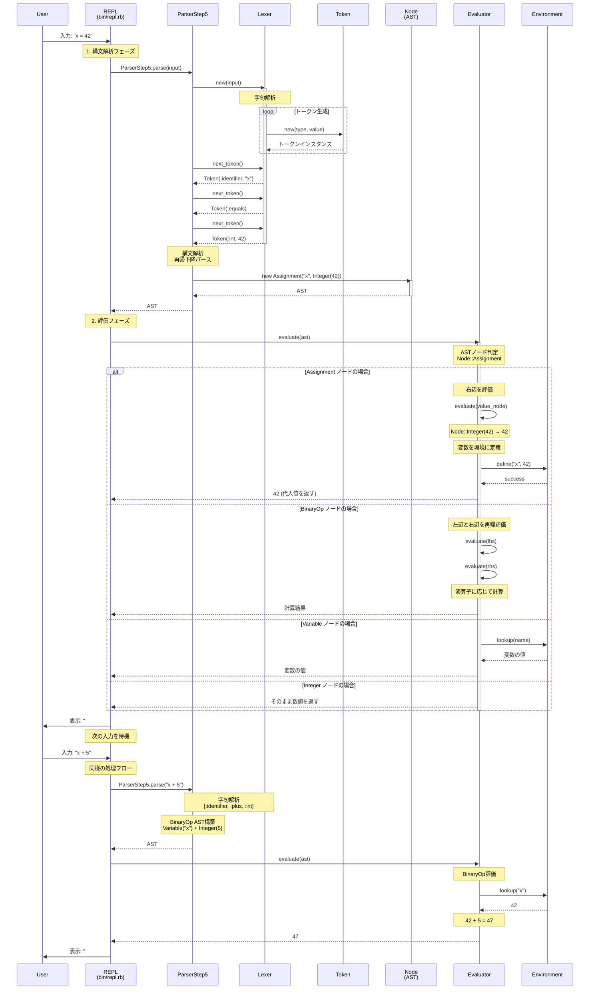

# Ruby Mini Language - 処理フローシーケンス図

## 概要
ユーザーがREPLに入力してから結果が表示されるまでの一連の処理を表現しています。
例: `"x = 42"` の入力から `"x + 5"` の評価まで

## シーケンス図

## 処理フェーズの詳細

### フェーズ1 - 字句解析
- **入力**: 文字列（`"x = 42"`）
- **処理**: Lexerが文字列をトークンに分割
- **出力**: Token配列（`[:identifier, :equals, :int]`）

### フェーズ2 - 構文解析
- **入力**: Token配列
- **処理**: Parserが文法規則に従ってASTを構築
- **出力**: AST（`Node::Assignment`）

### フェーズ3 - 評価
- **入力**: AST
- **処理**: EvaluatorがASTを巡回して実際の値を計算
- **出力**: 実行結果（`42`）

## 重要なポイント

- **状態管理**: Environmentが変数の状態をREPLセッション間で保持
- **再帰的評価**: EvaluatorがASTを深さ優先で巡回して評価
- **分離された責務**: 各クラスが明確な役割を持つ
- **一方向の流れ**: 文字列 → Token → AST → 結果
